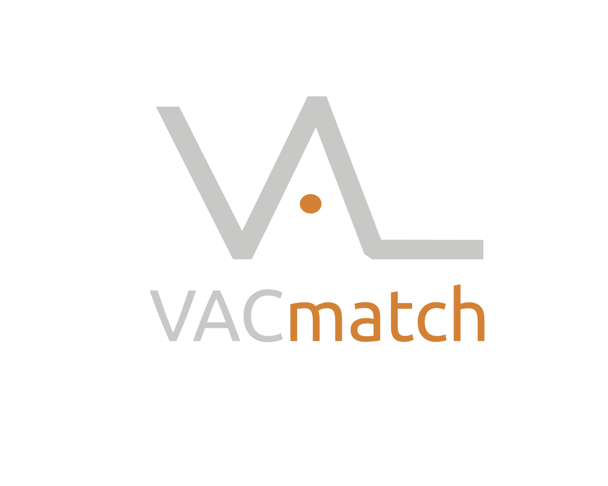

[](https://travis-ci.org/vacmatch/vacmatch-mobile)

# VACmatch mobile
VACmatch mobile is a web app to manage match reports in sports from your mobile phone.



### Requirements

- Gulp
- Node.js
- PouchDB
- CouchDB up and running

### Configuration

Add your CouchDB login data in *src/app/api/config.json*

Ex:
```
"production" : {
},
"development" : {
  "db": {
    "username": "admin",
    "password": "admin"
  }
},

"_env": "development"
```

### Execution

Install all dependencies

```
npm install
```

Run the app

```
gulp build

gulp run
```

Navigate to `localhost:8080/#/login` in your browser, check *src/app/router.jsx* for other routes.

In development mode, login is deactivated so you can access all app without login.

### Contributing

In order to contribute a patch (feature, bugfix, whatever), we are using a git-flow-like approach,
just fork the repo, create a `feature` or a `bugfix` branch and then send us a pull request ;)

**Master**

It's the stable version, all tests must be passed.

**Development**

It's an unstable branch where we work in development.

When a new release is created, ```development``` is merged in ```master```

### License
GNU AFFERO GENERAL PUBLIC LICENSE
